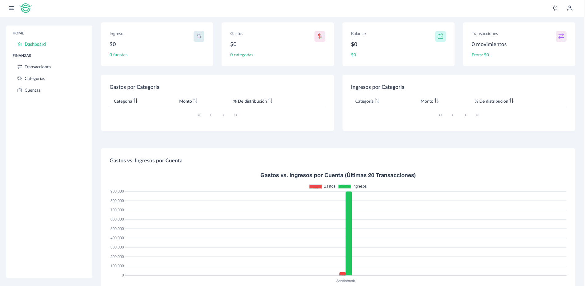
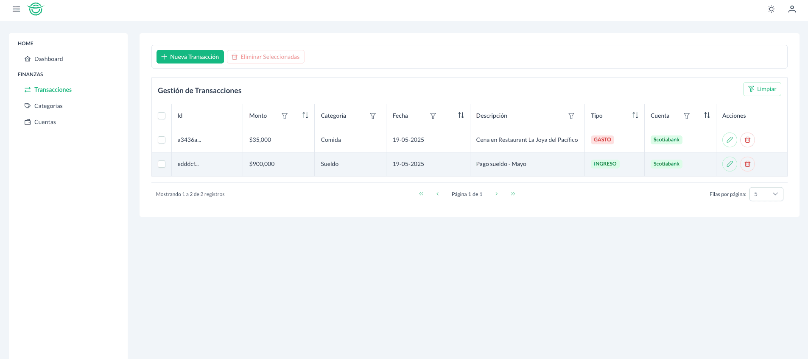
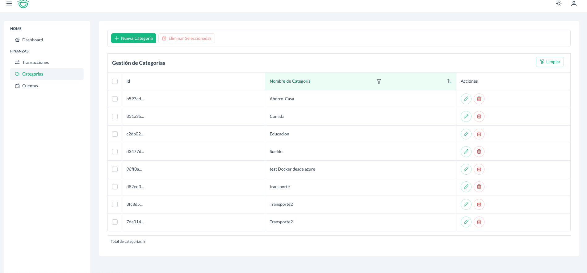
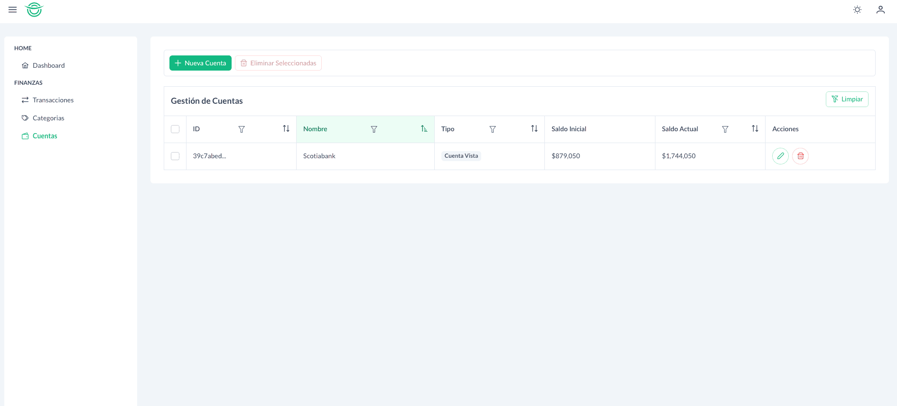

Personal Finance Tracker

Una aplicación web de finanzas personales sencilla, construida con Angular, diseñada para ayudarte a llevar un registro de tus transacciones, categorizar tus gastos e ingresos, y gestionar tus cuentas. Ideal para un control rápido y visual de tus movimientos financieros.

🚀 Características
* Dashboard Interactivo: Visión general de ingresos, gastos, balance y número de transacciones. Gráfico visuale para entender la distribución de gastos e ingresos por cuenta.
* Gestión de Transacciones:
    * Crear, Leer, Actualizar y Eliminar (CRUD) transacciones.
    * Asociar transacciones a categorías y cuentas.
    * Paginación: Navega eficientemente a través de grandes volúmenes de transacciones.
    * Filtros: Encuentra rápidamente transacciones específicas por diferentes criterios.
* Gestión de Categorías:
    * Crear, Leer, Actualizar y Eliminar (CRUD) categorías (ej. "Alimentos", "Transporte", "Salario").
    * Filtros: Busca y organiza tus categorías fácilmente.
* Gestión de Cuentas:
    * Crear, Leer, Actualizar y Eliminar (CRUD) cuentas (ej. "Cuenta Corriente", "Tarjeta de Crédito", "Ahorros").
    * Filtros: Encuentra tus cuentas sin esfuerzo.
* Integración con API Backend: Se comunica con una API RESTful para la persistencia de datos.

🛠️ Tecnologías Utilizadas
* Frontend:
    * Angular (v19.0.6)
    * TypeScript
    * PrimeNG (Componentes UI)
    * PrimeIcons (Iconos)
    * Chart.js (Gráficos)
    * Tailwind CSS (para utilidades CSS, si lo usas) o estilos SCSS/CSS personalizados.
* Backend (API):
    * Desarrollado en .NET 8
    * Desplegado en Azure Container Appps